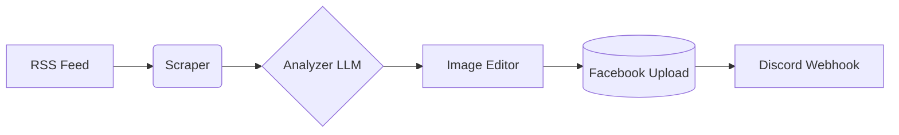

# GyanSansar Agent


An automated, cloud-based Python agent that monitors news sources, uses an advanced LLM to generate viral-style copy, designs a Facebook poster, uploads it to Facebook directly, and notifies you via Discord.

## Features
- **24x7 Automation**: Runs automatically using GitHub Actions.
- **Smart News Selection**: Automatically skips duplicates and only picks the most trending news.
- **AI Copywriting**: Integrates NVIDIA Nemotron LLM to generate click-worthy headlines and viral hooks.
- **Dynamic Image Editing**: Automatically downloads featured images, applies dark gradient overlays, adds drop-shadow typography, highlights key words in yellow, and brands the image with your logo.
- **Instant Notifications**: Sends an automated Discord message with the Facebook post details right after generation.

## System Architecture


## Setup & Configuration

This project requires several environment variables to function correctly. Rename `.env.example` to `.env` and fill in the details:

```env
DISCORD_WEBHOOK_URL="your_discord_webhook_url"
FACEBOOK_ACCESS_TOKEN="your_facebook_access_token"
FACEBOOK_PAGE_ID="your_facebook_page_id"
NVIDIA_API_KEY="your_nvidia_api_key"
BRANDING_TEXT="GyanSansar"
```

*Note: Update `assets/logo/logo.png` with the actual logo for GyanSansar.*

## Installation Guide

If you want to run this locally:
1. Clone the repository.
2. Create a virtual environment: `python3 -m venv venv`
3. Activate it: `source venv/bin/activate`
4. Install dependencies: `pip install -r requirements.txt`

## GitHub Actions Setup
1. Go to your GitHub Repository -> **Settings** -> **Secrets and variables** -> **Actions**.
2. Add the required **Repository Secrets** such as `DISCORD_WEBHOOK_URL`, `FACEBOOK_ACCESS_TOKEN`, `NVIDIA_API_KEY`.
